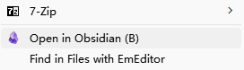

# ObsidianShell
Languages: [English](README.md), [简体中文](README.zh-Hans.md)

## Features
- Associate Markdown files with Obsidian
  
  In addition to making it easy to open notes, associating files helps integrate Obsidian into your workflows. For example, you can use a launcher to quickly open notes.
  
  For Chinese users:  
  配合支持拼音搜索的启动器，还可以间接实现通过拼音搜索笔记文件，比如：
  - [Everything](https://www.voidtools.com/) + [IbEverythingExt](https://github.com/Chaoses-Ib/IbEverythingExt)
  - [Listary](https://www.listarypro.com/)
  
- VaultRecent/Recent mode
  - Open standalone Markdown files in Obsidian, i.e., use Obsidian as a Markdown editor.
  - Enable the *global vault pattern*, which means that you can share one config with your notes at different locations.
  
- Open Markdown files in Obsidian through command line


## Installation
[Releases](https://github.com/Chaoses-Ib/ObsidianShell/releases)

Config file location: `%LOCALAPPDATA%\Chaoses Ib\ObsidianShell\ObsidianShell.Config`

### Set as the default program for Markdown files


1. Right-click on a .md file
2. Select `Open with` → `Choose another app` → `ObsidianShell.CLI`
3. Check `Always use this app to open .md files`
4. Click `OK`


## CLI
A command line interface program for opening Markdown files in Obsidian.

It supports three opening modes:
- VaultFallback (default)
  
  If the Markdown file you want to open is in a vault, open the vault, otherwise open the file using a custom Markdown editor.

  Related configuration:
  ```xml
  <add key="OpenMode" value="VaultFallback" />
  ```

  Markdown editor:
  - Notepad (default)
    ```xml
    <add key="MarkdownFallback" value="notepad" />
    <add key="MarkdownFallbackArguments" value="{0}" />
    ```

  - [Visual Studio Code](https://code.visualstudio.com/)
    ```xml
    <add key="MarkdownFallback" value="%LOCALAPPDATA%\Programs\Microsoft VS Code\Code.exe" />
    <add key="MarkdownFallbackArguments" value="{0}" />
    ```
    (The use of `code` is not recommended since it is actually an batch file and will cause some startup delays)

  - [Typora](https://typora.io/) (≥ 1.1)
    ```xml
    <add key="MarkdownFallback" value="C:\Program Files\Typora\Typora.exe" />
    <add key="MarkdownFallbackArguments" value="{0}" />
    ```
- VaultRecent
  
  If the Markdown file you want to open is in a vault, open the vault, otherwise link the file's parent directory to the Recent vault and then open the file.[^standalone]

  Related configuration:
  ```xml
  <add key="OpenMode" value="VaultRecent" />
  <add key="RecentVault" value="C:\path\to\Recent" />
  <add key="RecentLimit" value="10" />
  ```
  where `RecentVault` is the location of your Recent vault and `RecentLimit` is the maximum number of subdirectories in Recent.

- Recent
  
  Whether the Markdown file you want to open is in a vault, link its parent directory to the Recent vault and then open it.

  Related configuration:
  ```xml
  <add key="OpenMode" value="Recent" />
  <add key="RecentVault" value="C:\path\to\Recent" />
  <add key="RecentLimit" value="10" />
  ```


Notice: The vault where the Markdown file in (and the Recent vault) must be in the vault list of Obsidian before opening the file, i.e., you must have opened that vault before, otherwise Obsidian will report an error when opening the vault.


## ContextMenu


It is used to open the corresponding directory in Obsidian, complementing the defect that the CLI cannot be associated with directories.


[^standalone]: [Open and edit standalone Markdown files - Feature requests - Obsidian Forum](https://forum.obsidian.md/t/open-and-edit-standalone-markdown-files/14977)