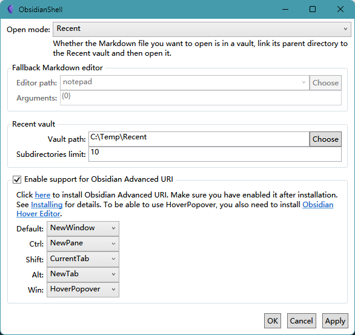

# ObsidianShell
语言：[English](README.md)、[简体中文](README.zh-Hans.md)

## 功能
- 关联 Markdown 文件到 Obsidian
  
  除了方便打开笔记外，关联文件还有助于将 Obsidian 集成进你的工作流，比如你可以使用一个启动器来快速打开笔记文件。

  配合支持拼音搜索的启动器，还可以间接实现通过拼音搜索笔记文件，比如：
  - [Listary](https://www.listarypro.com/)
  - [Everything](https://www.voidtools.com/) + [IbEverythingExt](https://github.com/Chaoses-Ib/IbEverythingExt)
  
- VaultRecent/Recent 模式
  - 在 Obsidian 中打开独立 Markdown 文件，将 Obsidian 用作一个 Markdown 编辑器
  - 实现全局仓库模式，让不同位置的笔记可以使用同一份配置
  
- 通过命令行在 Obsidian 中打开 Markdown 文件

## 安装
[Releases](https://github.com/Chaoses-Ib/ObsidianShell/releases)

配置文件路径：`%LOCALAPPDATA%\Chaoses Ib\ObsidianShell\Settings.json`

### 设为 Markdown 文件的默认程序

1. 右键单击一个 .md 文件
2. 选择 `打开方式` → `选择其他应用` → `ObsidianShell.CLI`
3. 勾选 `始终使用此应用打开 .md 文件`
4. 点击 `确定`

## CLI
一个用来在 Obsidian 中打开 Markdown 文件的命令行程序。

支持三种打开模式：
- VaultFallback（默认）
  
  如果要打开的 Markdown 文件在某个仓库中，打开该仓库，否则就用回落 Markdown 编辑器打开它。

  Markdown 编辑器：
  - 记事本（默认）
  - [Visual Studio Code](https://code.visualstudio.com/)
    
    不推荐用 `code`，它实际上是个批处理文件，会导致一些启动延迟。

  - [Typora](https://typora.io/)（≥ 1.1）

- VaultRecent
  
  如果要打开的 Markdown 文件在某个仓库中，打开该仓库，否则先把它的父目录链接到 Recent 仓库再打开它。[^standalone]

- Recent
  
  不论要打开的 Markdown 文件是否在某个仓库中，都先把它的父目录链接到 Recent 仓库再打开它。

注意：要打开的 Markdown 文件的仓库（以及 Recent 仓库）必须位于 Obsidian 的仓库列表中，也就是说，你必须在之前打开过那个仓库，否则 Obsidian 会在打开仓库时报错。

## ContextMenu
上下文菜单：  

该菜单用于在 Obsidian 中打开相应目录，补足 CLI 无法关联目录的缺陷。

[^standalone]: [Open and edit standalone Markdown files - Feature requests - Obsidian Forum](https://forum.obsidian.md/t/open-and-edit-standalone-markdown-files/14977)